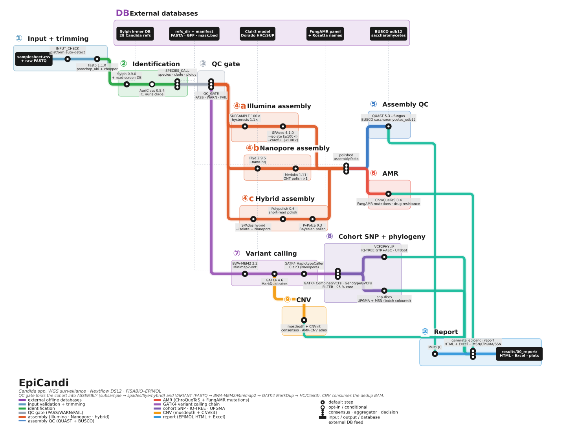

# epicandi

Nextflow DSL2 pipeline for *Candida* spp. surveillance — QC, identification,
assembly, AMR, SNP calling and cohort phylogeny + CNV.



## Quick start

```bash
# Smoke test (single C. auris B11220 Illumina sample, ~50 min on a 16-core node)
nextflow run . -profile test,conda --outdir results_smoke
```

## Real run

```bash
nextflow run . \
   -profile <conda|docker|singularity>,hpc \
   --input samplesheet.csv \
   --outdir results/ \
   --sylph_db /path/to/epicandi.syldb \
   --busco_downloads /path/to/busco_downloads
```

### Samplesheet

7 columns, comma-separated.  `NA` for missing reads / models / metadata.

```csv
id,illumina_r1,illumina_r2,nanopore,dorado_model,batch,is_external
S001,/data/S001_R1.fq.gz,/data/S001_R2.fq.gz,NA,NA,clinical_2026,false
S002,NA,NA,/data/S002.nano.fq.gz,r1041_e82_400bps_sup_v500,clinical_2026,false
S003,/data/S003_R1.fq.gz,/data/S003_R2.fq.gz,/data/S003.nano.fq.gz,r1041_e82_400bps_sup_v500,clinical_2026,false
```

- `illumina_r1/r2 = NA` → nanopore-only sample
- `nanopore = NA` → illumina-only sample
- both columns set → hybrid sample (Flye + Polypolish)

## Per-sample steps

1. **QC RAW** — FastQC (Illumina) / NanoPlot (Nanopore)
2. **CLEAN** — fastp · porechop_abi + chopper
3. **QC CLEAN** — FastQC / NanoPlot rerun
4. **QC GATE** — PASS/WARN/FAIL on read count + contamination
5. **IDENTIFICATION** — Sylph · per-read screen · AuriClass · `species_call`
6. **SUBSAMPLE** — target 100× coverage (1.1× hysteresis)
7. **ASSEMBLY** — SPAdes (Illu) · Flye+Medaka (Nano) · + Polypolish/PyPolca (Hybrid)
8. **POST_ASM_QC** — QUAST `--fungus` · BUSCO `saccharomycetes_odb12`
9. **AMR** — ChroQueTaS (FungAMR panel) · `chroquetas_join` (5-state)
10. **SNP_CALLING** — multi-platform variant calling layer:
    - Illumina / hybrid (tier HIGH): BWA-MEM2 → GATK4 MarkDuplicates → HaplotypeCaller → per-sample gVCF
    - Nanopore-only (tier MEDIUM): filtlong → minimap2 → Clair3
11. **CNV** — mosdepth + CNVkit (consume the dedup BAM)

## Cohort steps (per ≥ 3-sample group of same reference)

12. **JOINT GENOTYPING** — GATK4 CombineGVCFs + GenotypeGVCFs + filter (95 % core)
13. **PHYLOGENY** — vcf2phylip → snp-dists → IQ-TREE GTR+ASC
14. **NETWORK** — UPGMA epidemiological network (transmission ≤ 12 SNPs by default)

## HTML report

After the run, generate the EPIMOL HTML report + Excel companion:

```bash
python3 bin/generate_epicandi_report.py \
    --results-dir results/ \
    --run-name YYMMDD_MyRun \
    --samplesheet samplesheet.csv \
    --branding branding/ \
    --output results/00_report/YYMMDD_MyRun_epicandi_report.html
```

## External databases (NOT shipped in this repo)

| Database | Size | Default path |
|---|---|---|
| Sylph k-mer DB | ~420 MB | `/home/asanzc/epicandi_databases/sylph/sketches/epicandi.syldb` |
| BUSCO downloads | ~5 GB | `/home/asanzc/epicandi/resources/busco_downloads/` |
| Clair3 model (Nanopore) | ~50 MB | `/home/asanzc/epicandi/resources/clair3_models/<model>/` |

Override any of these at runtime with `--sylph_db <path>`, `--busco_downloads <path>`,
`--params.clair3_model <path>`.

## Self-contained assets

- 13 *Candida* reference genomes (FASTA + GFF3 + TRF/Dust masks) in `resources/references/`
- FungAMR panel + rosetta drug-name table in `assets/amr_db/`
- FungAMR CSV catalog in `resources/databases/fungamr/`
- CNV gene panel + AMR-CNV rules in `assets/cnv_loci/`

## Scaling

`conf/base.config` defines four label tiers:

| Label | cpus | memory |
|---|---|---|
| `process_single` | 1 | 6 GB |
| `process_low` | 2 | 12 GB |
| `process_medium` | 6 | 36 GB |
| `process_high` | 12 | 72 GB |

Per-host caps live in each profile's `resourceLimits`:

```
16-core node  →  resourceLimits = [ cpus: 16, memory:  64.GB ]
24-core node  →  resourceLimits = [ cpus: 24, memory:  96.GB ]
32-core node  →  resourceLimits = [ cpus: 32, memory: 128.GB ]
64-core fat   →  resourceLimits = [ cpus: 64, memory: 256.GB ]
```

GATK4 HaplotypeCaller and MarkDuplicates are explicitly capped at 4 cpus
(see `conf/modules.config`) — Pair-HMM saturates around 4-6 threads and
spare cores are better spent on the next sample's HC.

## Citing

Built on top of nf-core/tools.  Cite the original nf-core paper:

> Ewels P., Peltzer A., Fillinger S., Patel H., Alneberg J., Wilm A.,
> Garcia M.U., Di Tommaso P., Nahnsen S.
> *Nat Biotechnol.* 2020 Feb 13. doi: [10.1038/s41587-020-0439-x](https://dx.doi.org/10.1038/s41587-020-0439-x)

## License

MIT — see [LICENSE](LICENSE).
